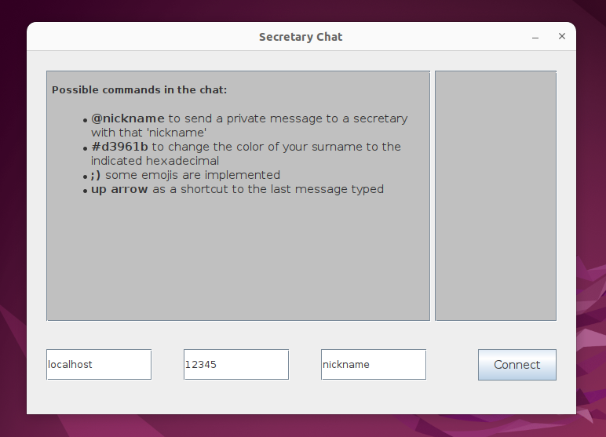

# Chat Messenger

This is a multi-client chat application.



# How to use

Run the server:
```shell
java Server.java
```

Start as many clients as you want:
```shell
java ClientGui.java
```

# References

The people who teach me how to do this, all credit to them:

- WittCode: [Java Socket Programming - Multiple Clients Chat](https://www.youtube.com/watch?v=gLfuZrrfKes);
- pchampio: [java-chat](https://github.com/pchampio/java-chat).